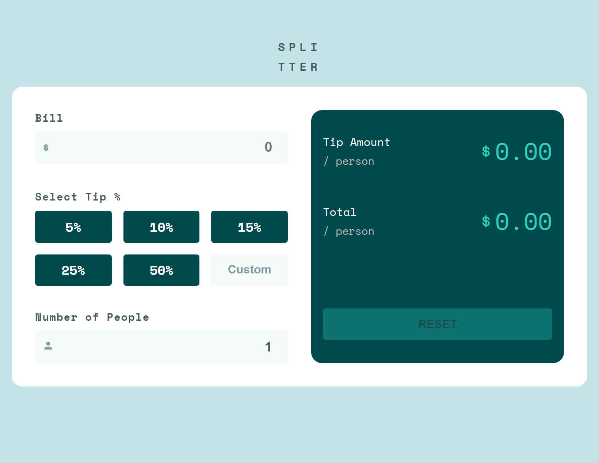
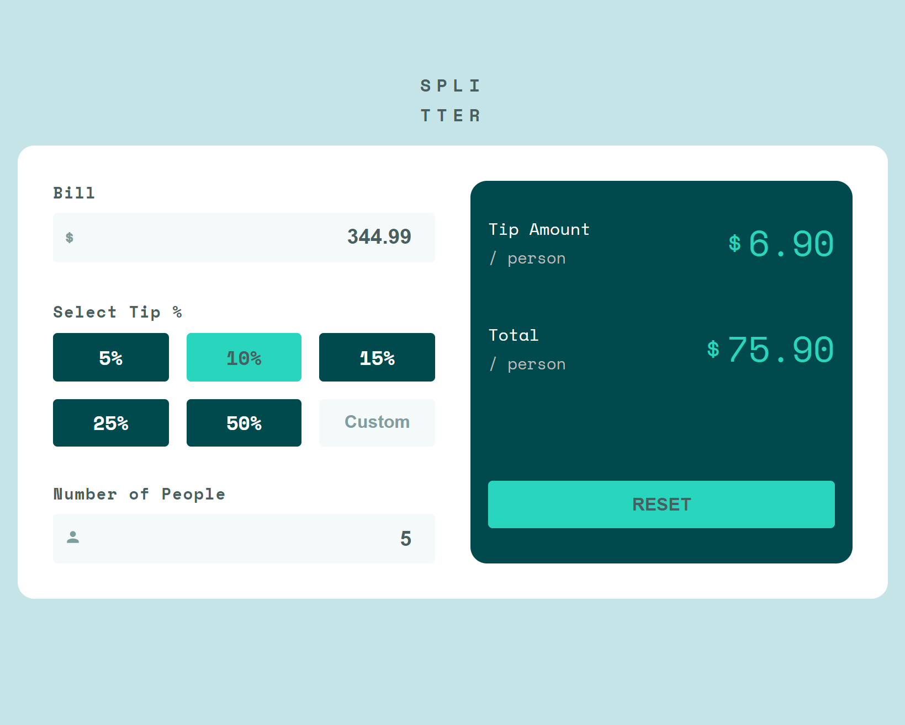

# Frontend Mentor - Tip calculator app solution

This is a solution to the [Tip calculator app challenge on Frontend Mentor](https://www.frontendmentor.io/challenges/tip-calculator-app-ugJNGbJUX). Frontend Mentor challenges help you improve your coding skills by building realistic projects.

## Table of contents

- [Overview](#overview)
  - [The challenge](#the-challenge)
  - [Screenshot](#screenshot)
  - [Links](#links)
- [My process](#my-process)
  - [Built with](#built-with)
  - [What I learned](#what-i-learned)
  - [Continued development](#continued-development)
- [Author](#author)
- [Acknowledgments](#acknowledgments)


## Overview

### The challenge

Users should be able to:

- View the optimal layout for the app depending on their device's screen size
- See hover states for all interactive elements on the page
- Calculate the correct tip and total cost of the bill per person

### Screenshot




### Links

- Solution URL: [https://www.frontendmentor.io/solutions/responsive-design-using-css-grid-2Di1GNrive](https://www.frontendmentor.io/solutions/responsive-design-using-css-grid-2Di1GNrive)
- Live Site URL: [https://splitterx.netlify.app/](https://splitterx.netlify.app/)

## My process

### Built with

- Semantic HTML5 markup
- CSS custom properties
- Flexbox
- CSS Grid
- Context API
- React Hooks - useState, useReducer
- Mobile-first workflow
- [React](https://react.dev/) - JS library

### What I learned

```css
.proud-of-this-css {
  user-select: none;
}
```

### Continued development

From working on this project, I have realized that I have to work on useReducer hook and thereafter, Redux. I also plan to work on some MERN stack based projects in the future.


## Author

- Frontend Mentor - [@peterxavier01](https://www.frontendmentor.io/profile/peterxavier01)
- Twitter - [@peter_uadiale](https://twitter.com/peter_uadiale)

## Acknowledgments

I would like to give a shout out to Stack Overflow, of course. And also ChatGPT which has been surprisingly helpful in providing hints on how to navigate the few roadblocks met along the way.
